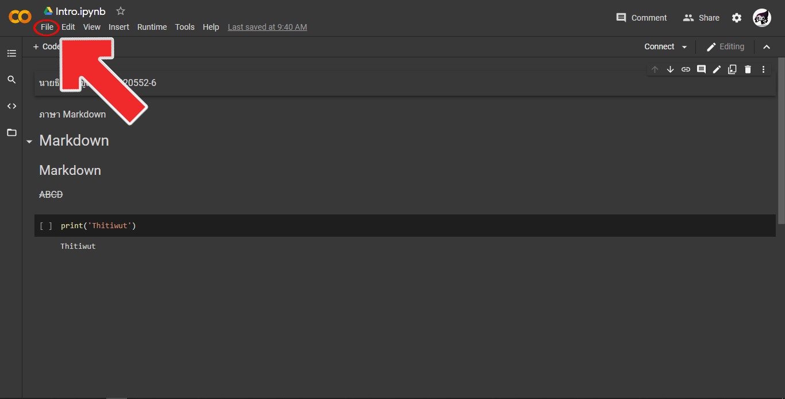
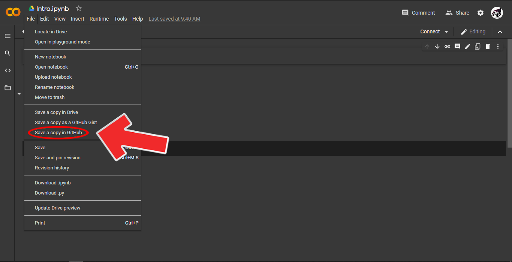
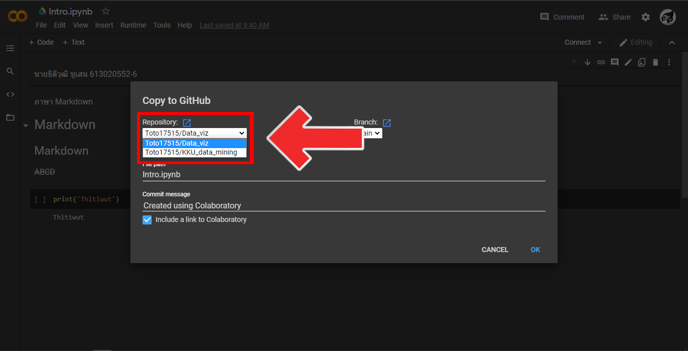
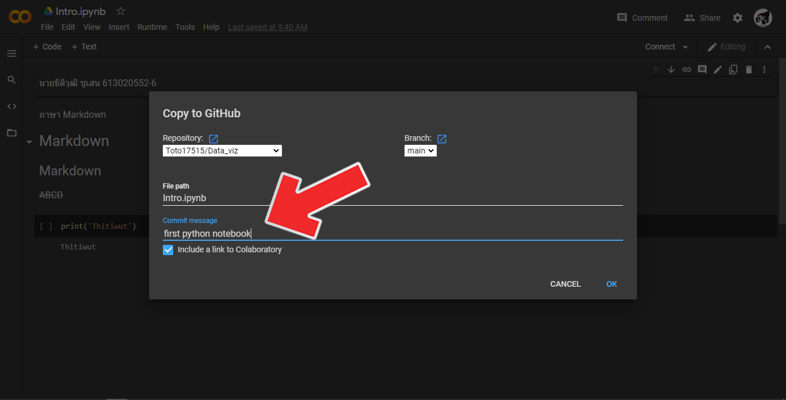

# Data_viz

ธิติวุฒิ ชูเสน 613010552-6

ตัวอย่างการเเทรกรูป

# การบ้านครั้งที่ 1

  ขั้นตอนการบันทึกไฟล์จาก Google Colab ไปยัง Github
  
ขั้นตอนที่ 1 ไปที่ File

ขั้นตอนที่ 2 กดที่ Save a copy in Github

ขั้นตอนที่ 3 พิมพ์ Commit Message

ขั้นตอนที่ 4 กด OK

เสร็จเรียบร้อย
